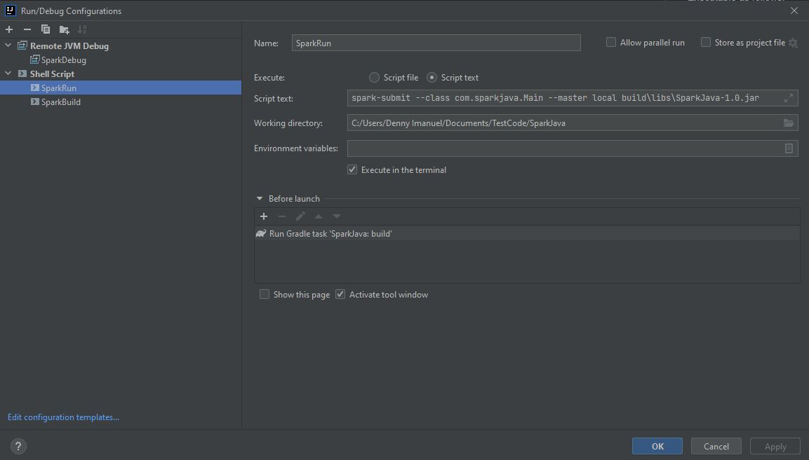
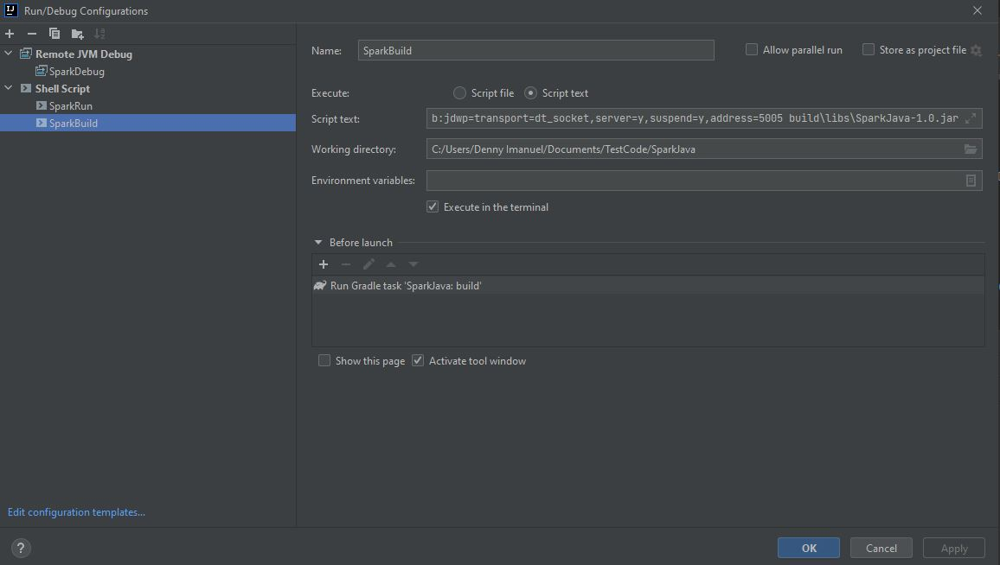
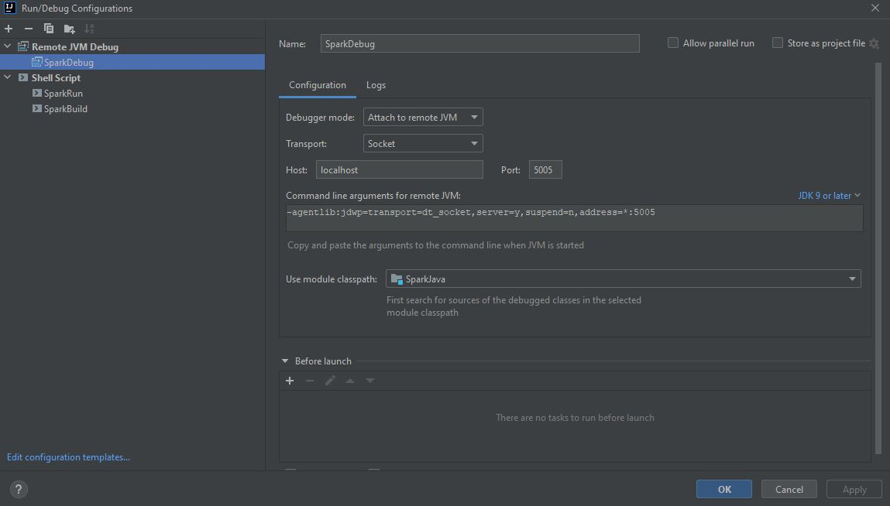
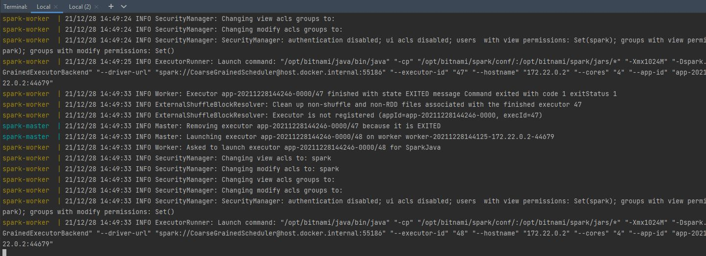
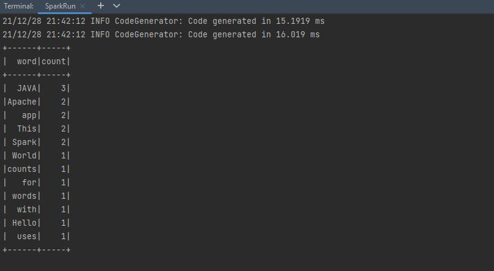

# Spark Java
by Denny Imanuel

This mini project showcase how to build and debug Apache Spark application using Java programming language.
There are also options to run Spark application on Spark container

## Spark on Localhost

### Requirement

1. IntelliJ IDE / Eclipse - You need to install IntelliJ IDE or Eclipse
2. Java JDK - You need to install Java JDK and set JAVA_HOME env
3. Gradle - You need to install Gradle and set GRADLE_HOME env
4. [Spark Hadoop](https://archive.apache.org/dist/spark/spark-3.1.2/spark-3.1.2-bin-hadoop3.2.tgz) - You need to install Spark Hadoop and set HADOOP_HOME and SPARK_HOME env

For more info: https://dotnet.microsoft.com/en-us/learn/data/spark-tutorial/install-spark

### Run Config

To run Spark app run Spark Submit command or create a new 'Run Config' under Shell Script as follows:

    gradle build
    spark-submit --class com.sparkjava.Main build\libs\SparkJava-1.0.jar

### Build Config

To build Spark app run Spark Submit command or create a new 'Build Config' under Shell Script as follows:

    gradle build
    spark-submit --class com.sparkjava.Main --conf spark.driver.extraJavaOptions=-agentlib:jdwp=transport=dt_socket,server=y,suspend=y,address=5005 build\libs\SparkJava-1.0.jar

### Debug Config

To debug Spark app create 'Debug Config' on Remote JVM Debug configuration file. In order to debug run above 'Build Config' first, set breakpoint, and then run this 'Debug Config':

    -agentlib:jdwp=transport=dt_socket,server=y,suspend=n,address=*:5005

## Spark on Docker

### Requirement

1. Rider IDE / Visual Studio - You need to install Rider IDE or Visual Studio
2. Docker Desktop - You need to install Docker Desktop to run Docker
3. Spark Image - Make sure you pull same version of Spark image as your local Spark:

>docker pull bitnami/spark:3.1.2

### Spark Clusters

Docker Compose below will run Spark cluster in master and worker node. Then you can submit jar file to master node.

    docker-compose up
    spark-submit --master spark://localhost:7070 --class com.sparkjava.Main build\libs\SparkJava-1.0.jar

### Output Result

If the Spark application is successfully build it should print out result table as follows:

    
    

